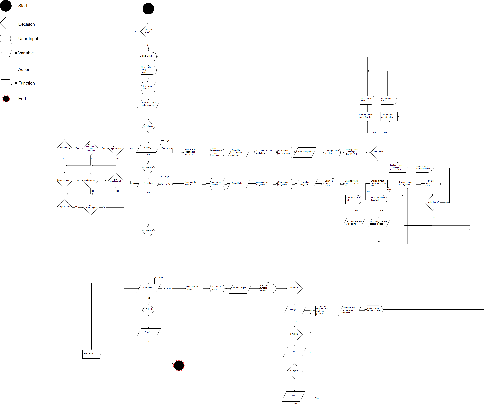

# Documentation

This file contains all the documentation for the Geo<>Code application.

## Software Development Plan

### Statement of Purpose and Scope

#### At a high level

At its optimal state, Geo<>Code will convert latitude and longitude to a physical address, and vice versa. Geo<>Code will also have a random location option, which will produce a random address in the world, this can be filtered down to Australia, or New Zealand.

#### Problem

Geo<>Code will solve the problem of needing to navigate to a world map, or a similar resource, when trying to find the latitude and longitude of a location, or the location which corresponds to a certain latitude and longitude. Geo<>Code can also be helpful for people who need to pick a random location, I'll get into this a little bit later.

#### Why?

While this problem is not one that people face every day, I decided to create this app to get a feel of Google's Maps API, as It could be interesting to work with it further, for example, using the API to figure out the best mode of transit, or how long each route will take to a location. Or incorporating that with the random function, giving an address, and only generating locations within a certain radius, all while providing data on the suggested route, mode of transit, and how long it will take.

#### User Stories

Although the application was mainly developed for fun, Geo<>Code also has practical use.

I've given two user stories here, one for the geocoding aspect of the program, and one for the random location feature.

##### Geocoding User Story

> As a City Council worker, I want to be able to easily convert a location to its latitude and longitude, and vice versa. This will help me to complete my work, as when I'm investigating a damaged road, I need to out specific paperwork, including the full address, latitude and longitude.

##### Random Location User Story

> As a Journalist, I want to be able to easily generate a random location in the world, and restrict it to certain regions. This will help me discover new, interesting, and sometimes undiscovered locations that I can write about. Being able to restrict the region of the generation lets me follow trends in the media, while not piggybacking off of other's stories.

### Features

Listed here are all the features of Geo<>Code and an explanation of what they do, their use of variables, loops, and their error handling.

#### latlong

This is the function that converts a location to it's corresponding latitude and longitude.

This function takes two variables, which are then set to streetnumberstreetname, and citystate. The way Google formats the addresses, it makes it easier to store the data in pairs as I have done, rather than concatenating at least 4 strings during the conversion. The variable scope is kept inside the one function, as it has no extra error handling functions. This feature has no extra error handling functions since there's no such thing as an invalid input, Google Maps API (hereafter GMAPS API) just searches for the nearest location, you can make a typo in your address and it's likely that you will still get the correct output. The most 'invalid' input is when none is given at all, which has a catch that returns None, and causes the query() function to print an error.

#### location

This function takes two variables, latitude and longitude, which are passed to the function via the menu. The two variables are then tested extensively, to see if it is able to be converted to an integer or a float, via is_int() and is_float(). if one of these pass, the function then sends the two variables to is_greater(), and if that returns True then it will finally be sent to reverse_geo_search(), and will return its result. Otherwise this function returns None to query() and an error will be printed. The variables for this function are passed like this:

query() > location() > is_int() > is_float() > is_greater() > reverse_geo_search()

#### reverse_geo_search

The location function is used to convert a latitude and longitude to a location, this function is called when all the tests in location pass.

This function takes two variables, latitude and longitude, the function then uses the GMAPS API to perform a Reverse Geocode Search with the two variables, the result of this search is then set to the variable reverse_geo_result, if the result is empty, the function returns none, else if the function contains a valid result, it is returned to location, which returns it to query(), which then prints the result.

#### random

This function is used to generate a random location.

The random function takes one variable, 'region', this variable is assigned to user input during the menu function. The function checks whether the region variable matches "AUS", "NZ" or "N", being Australia, New Zealand, and None respectively.

When a region is selected, two variables, randomlat and randomlong, will be assigned to a randomly generated number within the latitude and longitude range of that region, if the region None is passed, the random numbers range from the minimum to maximum of each value. If the function receives an invalid region, it returns None to the menu, else it will return the results of the random search to the menu.

### User Interaction and Experience

The user will find out how to interact and use each feature by viewing the README.md on GitHub, or downloading the repo and then reading it locally. Another option for the user to learn the required arguments, is for them to use the command `./geocode.py -h`, this provides a detailed explanation of what each arguments means, and what they are required for.

#### latlong

The user will use this feature to convert a formatted address e.g. 118 Walker Street, North Sydney NSW, to latitude and longitude. The only error handling this feature has is returning None if the result is empty, as there is otherwise no such thing as an invalid input. This is because the GMAPS API autocorrects the address to the nearest result. The user will learn what to input when selecting this option, as the query() function asks for a street number and name, while providing an example, and then does the same when asking for the city and state.

#### reverse_geo_search

The user will use this feature to convert latitude and longitude to a formatted address. This function has lots of error handling, in the form of location(), is_int(), is_float(), and is_greater(). This prevents the user from entering an invalid character, or a number that is too low or high. If this happens, it will return none, resulting in the menu function printing an error. The user will learn what to input when selecting this option, as the query() function asks for a latitude and longitude, and provides a range for these values.

#### random

The user will use this feature to generate a random location, and depending on the user's selected region, a location within a specific range. If an invalid region is given, this function will return None, and cause query() to print an error. Sometimes this function will random into an empty result, which ends in query() printing that either the API couldn't find anything interesting, or they selected an invalid region. Just like the other features, the user will learn what to input when selecting this option, as the query() function asks for a region, and provides all the valid options.

### Control Flow Diagram

### Implementation Plan

Here's what my Trello board looked liked as of writing this document. Each function has its own list, but each card can be shared on all of them. For the cards, P stands for priority, and ranges from 1-10, lowest to highest, and D stands for duration, where m is for minutes.

| Function Name      | Function checklist                                           | Priority | Duration |
| ------------------ | ------------------------------------------------------------ | -------- | -------- |
| query/gmaps_menu   | - printing options                                           | 3        | 10m      |
|                    | - taking user input                                          | 3        | 5m       |
|                    | - split into two functions                                   | 1        | 2m       |
|                    | - checks for args                                            | 7        | 15m      |
|                    | - error handling                                             | 10       | 10m      |
|                    |                                                              |          |          |
|                    |                                                              |          |          |
| latlong            | - takes two variables                                        | 3        | 1m       |
|                    | - concatenates variables                                     | 5        | 1m       |
|                    | - performs conversion                                        | 10       | 2m       |
|                    | - returns result                                             | 7        | 1m       |
|                    | - error handling                                             | 10       | 3m       |
|                    |                                                              |          |          |
| reverse_geo_search | - location (error handling)                                  | 10       | 26m      |
|                    | - is_int (error handling)                                    | 8        | 3m       |
|                    | - is_float (error handling)                                  | 8        | 3m       |
|                    | - is_greater (error handling)                                | 8        | 10m      |
|                    | - performs conversion                                        | 10       | 1m       |
|                    |                                                              |          |          |
| random             | - randoms in a range                                         | 4        | 10m      |
|                    | - takes a region argument                                    | 3        | 5m       |
|                    | - error handling                                             | 10       | 3m       |
|                    | - calls reverse_geo_search with randomly generated variables | 10       | 1m       |
|                    | - returns result                                             | 7        | 1m       |

gmaps_menu handles all menu related code, like printing options, taking arguments, while query takes the user input after an option is selected, these two were originally one function, but were split to meet linting standards.

While the checklist for something like latlong may be very specific, the code for the function itself is only four lines long.

reverse_geo_search shares the same checklist as latlong, but carries lots more error handling, with four extra functions for it.

random, like latlong, is very simple, so its checklist is quite specific.

 