# Geo<>Code

Geo<>Code is a tool that allows users to convert a location into it's latitude and longitude, and vice versa. Geo<>Code also has a random function, which will print the address of a random location.

## Installation

### Running the Build

If you want to build the program yourself, skip to the next section, otherwise enter the following into your terminal:

` cd dist`

`./geocode`

### Building It Yourself

I've already written a script that will build the program for you, simply remove the dist that came with the repo, and then run the script like so:

`rm -r dist`

`./build.sh`

then refer to the 'Running the Build' section

### Running the source code

For this option, you'll need your own Google API key, with Geocoding enabled. You will also need all the dependencies, which are listed below this section.

Open the script with a text editor (sublime text, nano, vim)

`nano geocode.py`

Then paste in your API key in between the quotes in this line:

`GMAPS = googlemaps.Client(key="")`

So it should look like this

`GMAPS = googlemaps.Client(key="YOUR_KEY_HERE")`

Then, save the changes, and run the script via terminal like so:

`./geocode.py`

#### Dependencies

If you decide to run the source code for this program, you'll need to install these libraries:

- googlemaps
- argparse (built in)
- random (built in)

### System/Hardware Requirements

Dependencies listed above

Python3

This program was only tested on wsl, your operating system may not be able to run it.

### Features & Usage

#### Latlong

Converts a location to its latitude and longitude.

##### Usage

###### With Args

`./geocode --latlong -streetnumberstreetname -citystate`

To check what args are needed, or what to input after setting them, do:

`./geocode -h`

###### Without Args

`./geocode`

Select latlong in the menu.

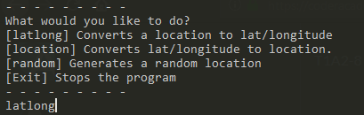

` latlong`

Enter a street number, and street name.

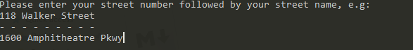

`1600 Amphitheatre Pkwy`

Enter a city and state.

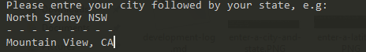

`Mountain View CA`

Voila, here's our result!

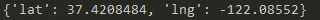

#### Location

Converts latitude and longitude to an address.

##### Usage

###### With Args

`./geocode --location -lat -longitude`

To check what args are needed, or what to input after setting them, do:

`./geocode -h`

###### Without Args

`./geocode`

Select location in the menu

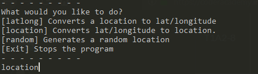

`location`

Enter a latitude, (ranges from -90 to 90)

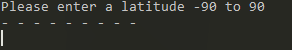

`45`

Enter a longitude, (ranges from -180 to 180)

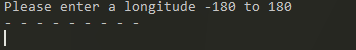

`60`

Here's our result:

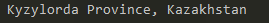

#### Random Location

Generates a random location, can be restricted to a region.

##### Usage

###### With Args

`./geocode --random -region`

To check what args are needed, or what to input after setting them, do:

`./geocode -h`

###### Without Args

`./geocode`

Select random in the menu.

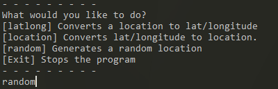

`random`

Select a region to search in, selecting N will generate a location anywhere in the world, whereas AUS will only be in Australia.

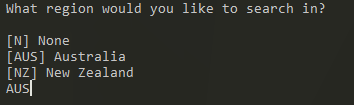

`AUS`

Sweet!

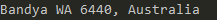

